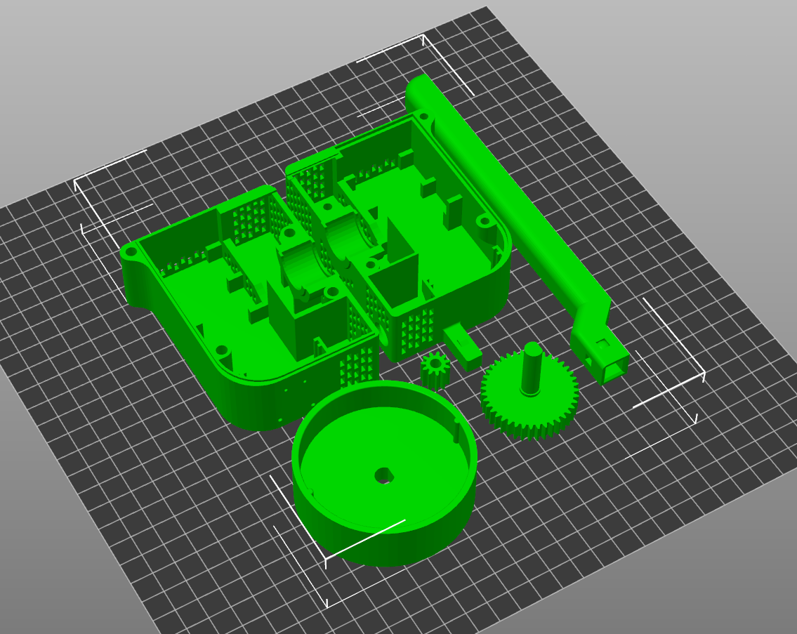

The .3mf file is the PrusaSlicer profile that includes everything arranged on a single platter for the CR-10 printer with a metal hotend and .6mm nozzle. It might provide a good starting point for some, but I expect that the settings will need to be adjusted to your individual printer. 

### For version 2, print:

## [Case]
-Body_Left.stl

-Body_Right.stl

## [Gears]
-SS2K_40T_Mod1_Spur_Gear.STL

-Spur gear 1M 11T.STL

## [MountingStrap]
-Mounting_For_New_Case.STL

## [KnobCups]
Knob_Cup_Large_HEX.STL

## [Inserts]
-The insert for your bike.

## Please see below for how the new HEX shaft is installed. 

After you have ensured everything fits properly, put a drop of red or blue loctite on both nuts. 

Use 4 Black Oxide #8 general purpose screws to secure the case.  
