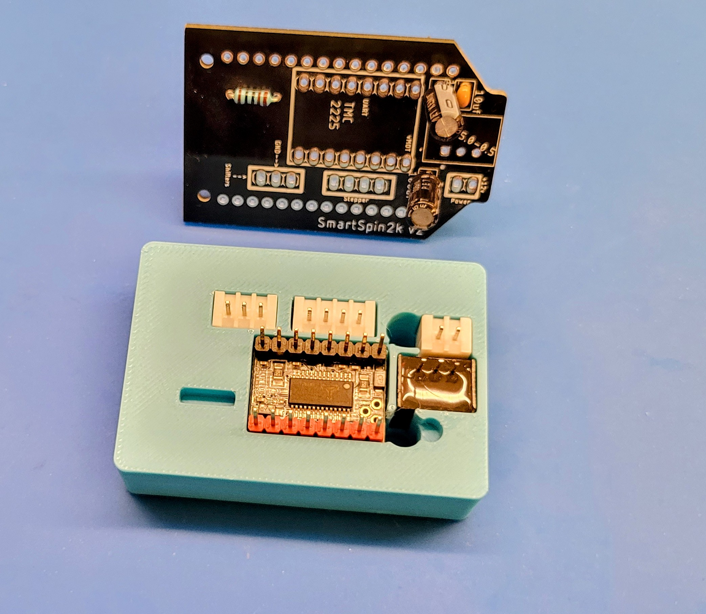
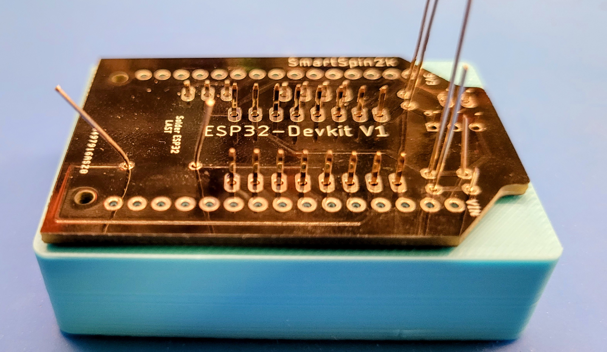

# Soldering Jig
While the PCB is quite simple and easy to solder by hand, it may be daunting for new users.  This jig was originally created to help reduce the time and effort involved in making PCB's.  By placing all the small components exactly where they need to be and rendering them immobile, it becomes hugely simpler for someone to solder the PCB with little to no soldering experience.

WARNING: It's advisable to print this with ABS or PETG due to their higher melting temperatures.  While the PCB should be an effective insulator and shield the plastic from heat, do not let the tip of the iron dwell for too long as the printed plastic may warp or melt.  This print has been tested with ABS.  

## Instructions
* Insert capacitors and resistors directly into the PCB.  
* Insert the JST connectors, Recom, and stepper motor controller into their respective slots.  Be mindful of orientation.
* Apply PCB over the soldering jig
* Soldering

