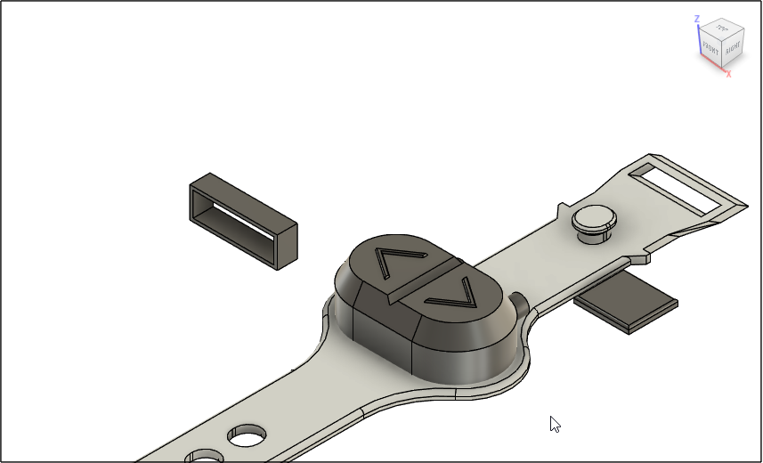
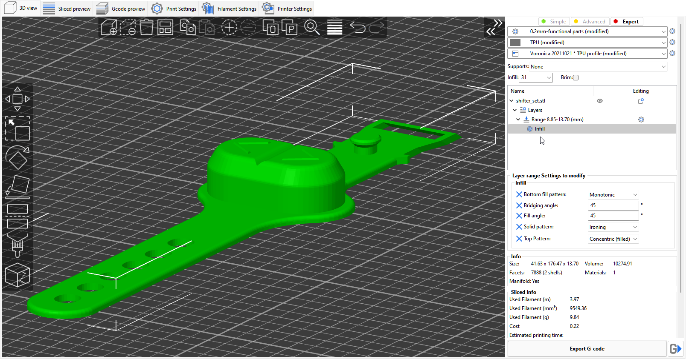

# 2-in-1 strap
This part is designed to be printed with TPU

This update brings tactile feedback to the shifter and merges two shifters into one housing.

Fusion 360 exports and generic STEP files are both provided

## Assembly
- Extra care must be taken when soldering since the orientation of the wires makes a difference. You must decide up front whether you want the cables to exit  towards the rear or towards the front and wire the left/right channels.  Before cutting the RCA ends of the cable, plug the shifter into your assembled SS2k and short the red audio connector with a paperclip or screwdriver.  Make note of the direction this turns the knob and wire your shifters accordingly.
- In case you need to flip the orientation of the strap on your bike, you can swap the outer pins on the shifter connector where it attatches to the PCB.  These control the left/right signal from the cable.

## BOM
- 2 microswitches
- 1 RCA to 3.5mm audio cable
[See Wiki for up to date sources](https://github.com/doudar/SmartSpin2k/wiki/Recommended-Hardware)

## Printing instructions
The bridging layers on this print are tricky to get right with TPU.  It is important to minimize gaps in the bridging layers and ensure it is well sealed against sweat and water.  The instructions listed here have worked well in Superslicer.  

With good cooling and a slow print speed, this print is very achievable. 

If you are unsure and need to calibrate your TPU printing, use [test_housing.stl](test_housing.stl) before printing the entire strap  - this will print much more quickly than the full strap and allow you to dial in the print using less material and time.

- Cooling fan at 75% (this is different for every printer and duct - I'm using a single 5015 fan)
- 0.2mm layer height with 0.4mm nozzle
- 3 perimeters
- Supports disabled
- 20% infill
- Monotonic top, solid, and bottom infills
- Infill Angle - 90 Degrees (You want the lines following the length of the strap)
- 
- Add a height range modifier on the strap from 8.85-13.70mm with the following settings.  The combination of ironing and concentric infill help ensure a watertight finish.
-- Solid Infill pattern: Ironing
-- Top Infill Pattern: Concentric
-- 

## [Strap]
-strap.stl

## [Test Print]
- test_housing.stl