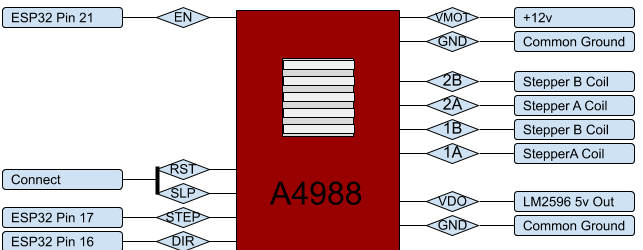

# SmartSpin2K

Hardware (3d Printed) and Software Project that uses an ESP32 and servo motor to control spin bikes that have a resistance knob. 
The initial target was to use it with Zwift: stationary bike up hills and feel the burn.

## Background
I travel for a living and most hotels have spin bikes. I started carrying my own power meter pedals for the spin bikes so I could ride Zwift but the experience just isn't the same without automatic resistance on the hills. Then one day I was looking down at that simple to turn knob and I had a thought - With the power meter pedals attached, almost everything is already in place on this $300 spin bike to turn it into the equivalent of a $3,000 computer controlled smart bike! And so here we are....

## Summary of function
The power meter pedals send cycling power and cadence to Zwift (or any other cycling app). Smartbike 2k connects to the APP as a controllable trainer which then simulates gradient by automatically turning the knob a set amount for each percent grade change on your virtual road. Very soon the pedals will be able to connect directly to SmartBike2k (with the data relayed to your app of choice) which will enable ERG mode (where SmartBike2k adjusts the knob to make you maintain a steady watt output no matter what your cadence is) on the spin bike. In addition to adjusting the knob, SmartBike2k also has shifter buttons to simulate virtual shifting. 

### Hardware:

|qty   |         Part             |              Link                      |
|:-----:|--------------------------|---------------------------------------:|
|1      | ESP32 Dev Board          | <a target="_blank" href="https://www.amazon.com/gp/product/B073QDK74F/ref=as_li_tl?ie=UTF8&camp=1789&creative=9325&creativeASIN=B073QDK74F&linkCode=as2&tag=doudar-20&linkId=b3b820a02e67ea96384e4d4c2e7e2fc4">ESP-32 Dev Board </a>  |
|1      | NEMA 17 Pancake Stepper  | <a target="_blank" href="https://www.amazon.com/gp/product/B07TB4RWLS/ref=as_li_tl?ie=UTF8&camp=1789&creative=9325&creativeASIN=B07TB4RWLS&linkCode=as2&tag=doudar-20&linkId=7d6838312db1cdf3ed3a69c86b150651">Nema 17 Pancake Stepper Motor</a>  |
|1      | A4988 Driver Board       | <a target="_blank" href="https://www.amazon.com/gp/product/B01FFGAKK8/ref=as_li_tl?ie=UTF8&camp=1789&creative=9325&creativeASIN=B01FFGAKK8&linkCode=as2&tag=doudar-20&linkId=cd16de10c13b21b02f140d4af4a41ebb">A4988 Compatible StepStick</a>  |
|1      | LM2596 Buck Converter    | <a target="_blank" href="https://www.amazon.com/gp/product/B07C2QF1T1/ref=as_li_tl?ie=UTF8&camp=1789&creative=9325&creativeASIN=B07C2QF1T1&linkCode=as2&tag=doudar-20&linkId=9b163bfdc2fffab96dc432ad2dbd7bea"> LM2596 DC-DC Adjustable Buck Converter</a>  |
|1      | 12V Power Supply         | <a target="_blank" href="https://www.amazon.com/gp/product/B01461MOGQ/ref=as_li_tl?ie=UTF8&camp=1789&creative=9325&creativeASIN=B01461MOGQ&linkCode=as2&tag=doudar-20&linkId=fe7efd64e9920680e89e1ac9213bd7ab">12v Power Supply</a>  |
|2      | Push Button Switches     | https://www.amazon.com/dp/B076RLL1KM/  |
|2      | 608 Skate Bearings       | https://www.amazon.com/dp/B07R7PR72H/  |

Optional equipment so you can actually use it for fitness:
|qty    |         Part             |              Link                      |
|:-----:|--------------------------|---------------------------------------:|
|1      |Assioma Pedals(or similar)| <a target="_blank" href="https://www.amazon.com/gp/product/B08BDPFY9Y/ref=as_li_tl?ie=UTF8&camp=1789&creative=9325&creativeASIN=B08BDPFY9Y&linkCode=as2&tag=doudar-20&linkId=f79dddc28e6b5bdd317bb2dbce4fad8c">FAVERO Assioma Uno</a>       |                   
|1      |Cheap Spin Bike Check Ebay| <a target="_blank" href="https://www.amazon.com/gp/product/B08FDCW184/ref=as_li_tl?ie=UTF8&camp=1789&creative=9325&creativeASIN=B08FDCW184&linkCode=as2&tag=doudar-20&linkId=e78975c4a750cec5349cea961f24115c">Indoor Exercise Bike</a> |

So for $700-$1000 you can build a fully functional smart bike! If you already have a Peleton bike collecting dust in the corner, this will work on that too!

### Full Documentation Soon
But if you're adventerious and handy you can probably take a look at my pictures below or the assembly video and start tinkering. Feel free to reach out in the meantime as I'd love to help someone get this working for themselves. In short, the process is:

1: Get Microsoft Visual Code installed. 
2: Install PlatformIO into Visual Code.
3: Install the ESP32 package into PlatformIO
4: Install the Arduino-Core Package for PlatformIO
5: Compile the project and upload to an ESP32
6: Print all the hardware. You'll need 1 Bottom Case, 1 Knob Cup, Both Spur Gears, 1 Stepper Crossbar, 1 Top Cover and a knob insert that fits your spin bike. PETG works well.
7: If you're using the same switches for the shifters, you can optionally print the provided files. Previously I was using tape as a protective enclosure and it worked fine (if ugly).
8: Wire all of the connections outside the case. Use push on connectors if possible. 
9: Press both bearings into the recess.
10: Install the power supply, stepper driver and ESP32 into their brackets.
11: Install the power plug and shifter plug. 
12: Push the large gear down into the bearing. From the other side slide the knob cup onto it's shaft.  
13: Attach the stepper crossbar to the stepper motor.
14: Install the stepper motor. 
15: Put the cover on. 

ummm that was easy...right? :)

### Esp32 Connection Diagram
 

### A4988 Connection Diagram
 

The hardware mentioned above mounts into a 3d printed enclosure which then easily attaches to a spin bike.

The Finished assembly looks somthing like this prototype. 

Here is the earliest prototype mounted on a spin bike. (Cardboard wrapped in ducktape enclosure :) ) 

This is my first GitHub project and one of my first (recent) large coding projects, so any help or feedback is greatly appreciated.

