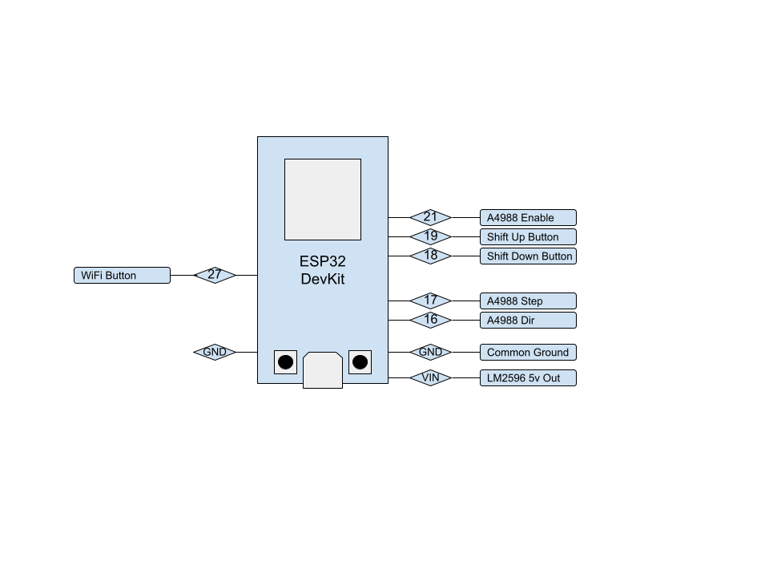
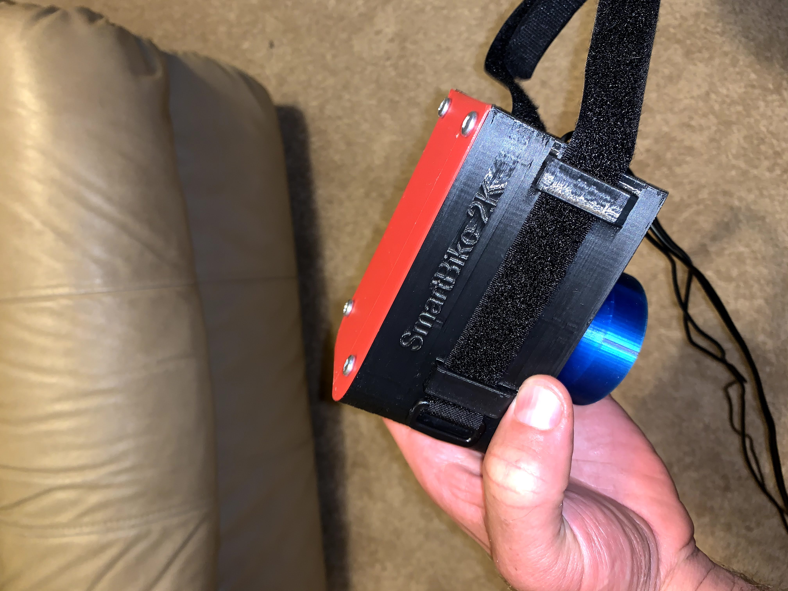

# SmartBike2k

Hardware (3d Printed) and Software Project that uses an ESP32 and servo motor to control spin bikes that have a resistance knob. 
The initial target is to get it working with Zwift (which it is).

# Background
I travel for a living and a hotel I frequent has spin bikes. I had recently started swapping my own power meter pedals onto the spin bike so I could ride Zwift when I travel but the experience just isn't the same without automatic resistance on the hills. Then when I was looking down at that simple to turn knob one day I had a thought - With the the power meter pedals attached, almost everything is already in place on this $300 spin bike to turn it into the equivelant of a $3,000 computer controlled smark bike! And so here we are....

## Summary of function
The power meter pedals send cycling power and cadence to Zwift (or any other cycling app). Smartbike 2k also connects to the APP as a controllable trainer which then simulates gradient by automatically turning the knob a set amount for each percent grade change on your virtual road. Very soon the pedals will be able to connect directly to SmartBike2k (with the data relayed to your app of choice) which will enable ERG mode (where SmartBike2k adjusts the knob to make you maintain a steady watt output no matter what your cadence is) on the spin bike. In addition to adjusting the knob, SmartBike2k also has shifter buttons to simulate virtual shifting. 

### Hardware:

|qty   |         Part             |              Link                      |
|:-----:|--------------------------|---------------------------------------:|
|1      | ESP32 Dev Board          | https://www.amazon.com/dp/B073QDK74F/  |
|1      | NEMA 17 Pancake Stepper  | https://www.amazon.com/dp/B07TB4RWLS/  |
|1      | A4988 Driver Board       | https://www.amazon.com/dp/B01FFGAKK8/  |
|1      | LM2596 Buck Converter    | https://www.amazon.com/dp/B07C2QF1T1/  |
|1      | 12V Power Supply         | https://www.amazon.com/dp/B01461MOGQ/  |
|2      | Push Button Switches     | https://www.amazon.com/dp/B076RLL1KM/  |
|2      | 608 Skate Bearings       | https://www.amazon.com/dp/B07R7PR72H/  |

Optional equipment so you can actually use it for fitness:
|qty    |         Part             |              Link                      |
|:-----:|--------------------------|---------------------------------------:|
|1      |Assioma Pedals(or similar)| https://cycling.favero.com/shop/       |                   
|1      |Cheap Spin Bike Check Ebay| https://www.amazon.com//dp/B08FDCW184/ |

So for $700-$1000 you can build a fully functional smart bike! If you already have a Peleton bike collecting dust in the corner, this will work on that too!

### Full Documentation Soon
But if you're adventerious and handy you can probably take a look at my pictures below and the attached project and start tinkering. Feel free to reach out in the meantime as I'd love to help someone get this working for themselves.

### Esp32 Connection Diagram

*Enable Pin is not configured yet. Coming very soon. 

The hardware mentioned above mounts into a 3d printed enclosure which then easily attaches to a spin bike.

The Finished assembly looks somthing like this prototype. 

Here is the earliest prototype mounted on a spin bike. (Cardboard wrapped in ducktape enclosure :) ) 

This is my first GitHub project and one of my first (recent) large coding projects, so any help or feedback is greatly appreciated.

