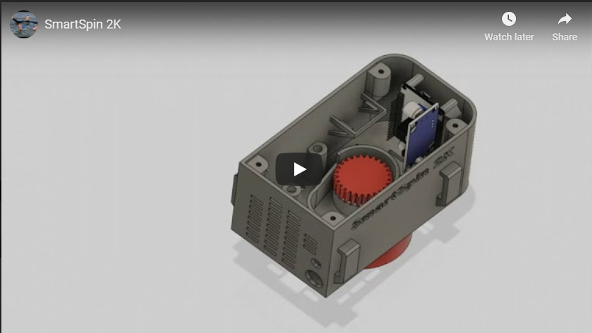
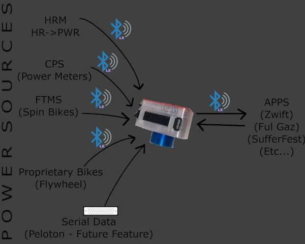
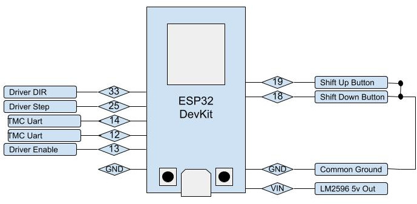
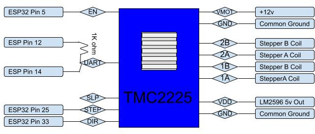
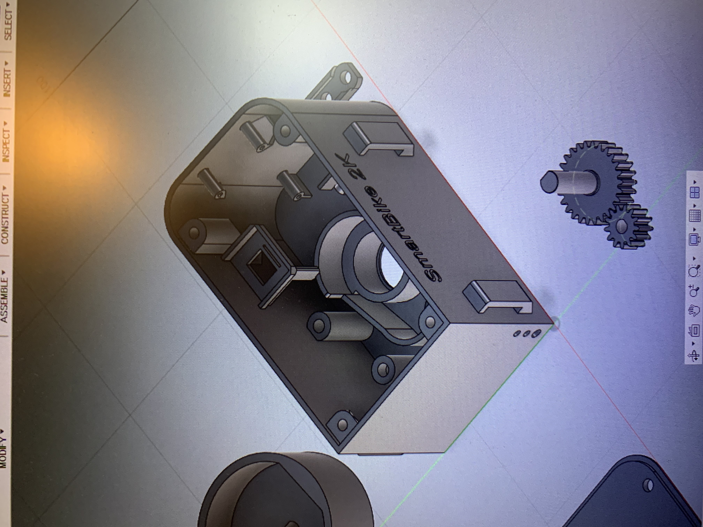
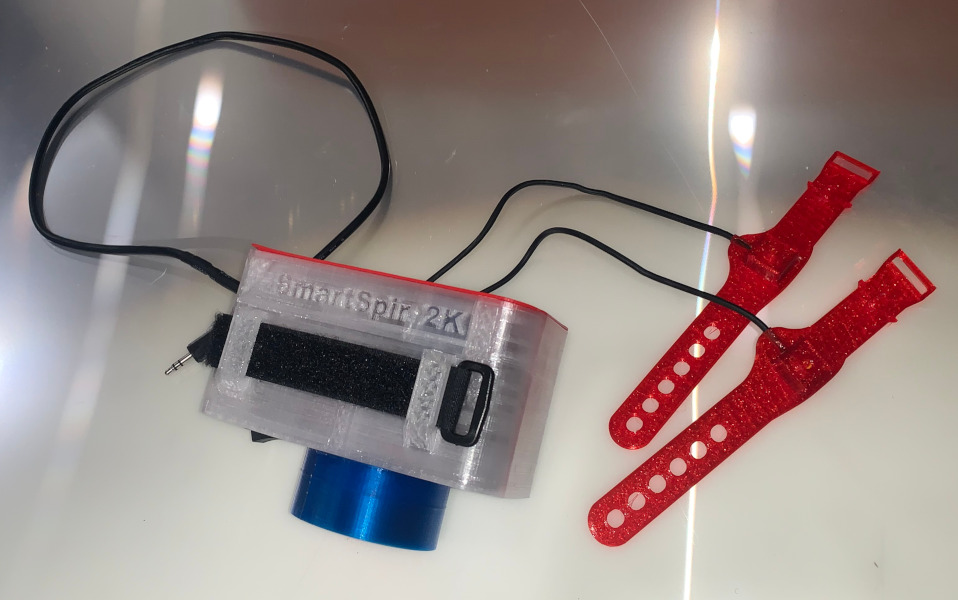
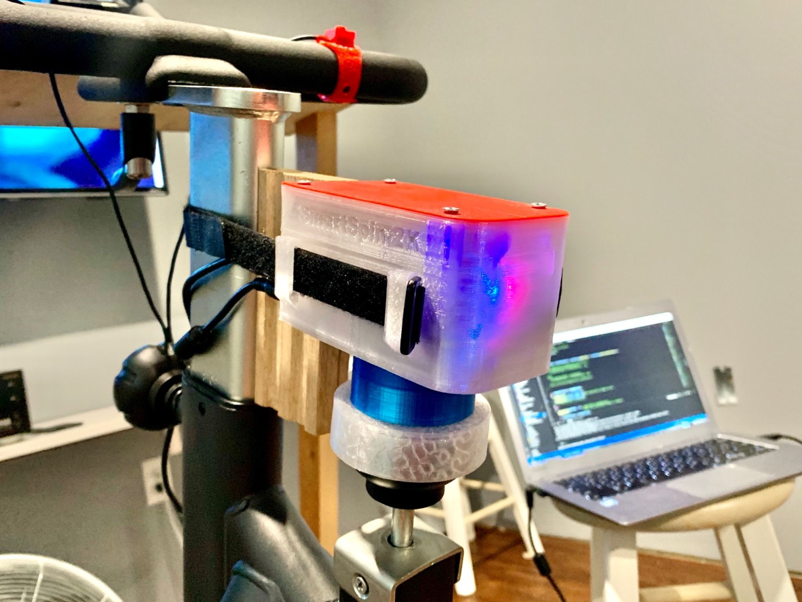
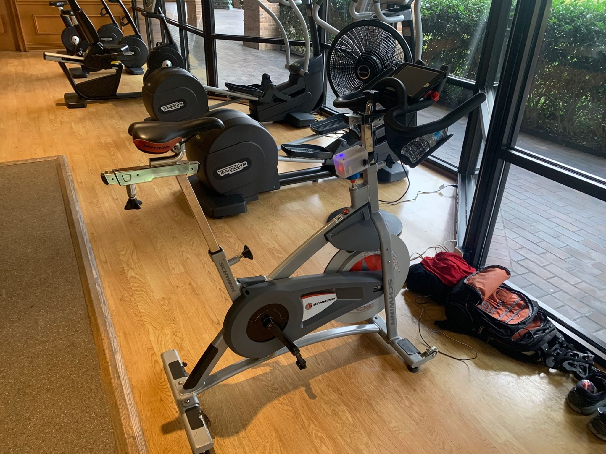
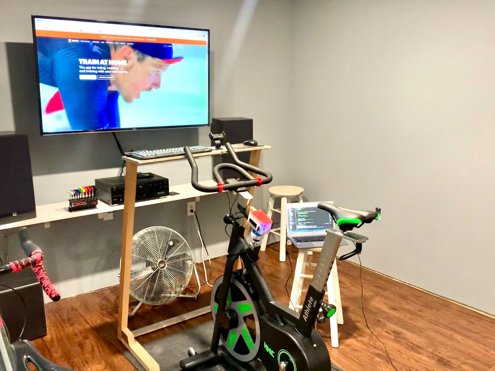
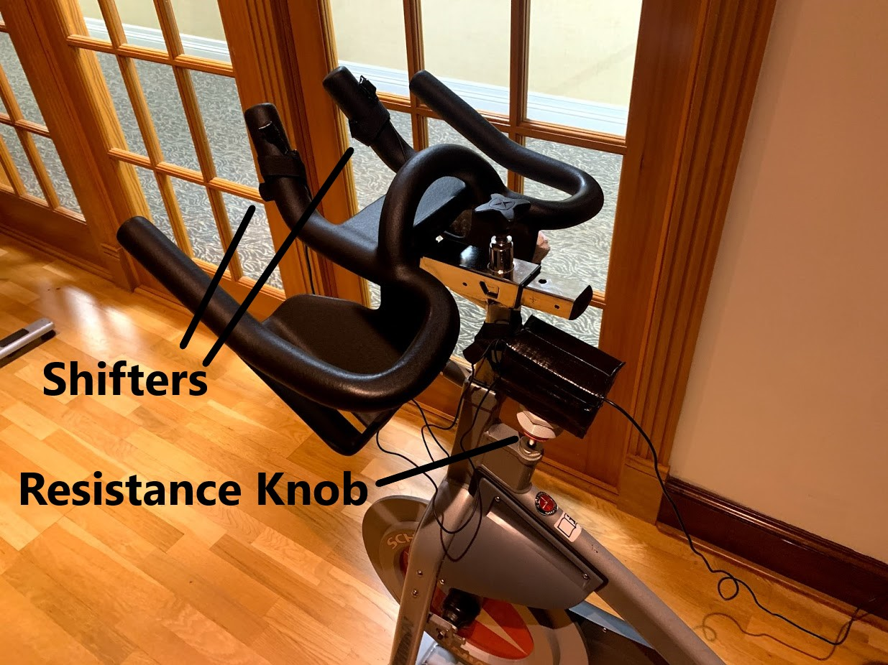

Http://GitHub.com/doudar/SmartSpin2K
# SmartSpin2K

Hardware (3d Printed) and Software Project that uses an ESP32 and stepper motor to control spin bikes that have a resistance knob. 
The initial target was to use it with Zwift: stationary bike up hills and feel the burn. 

Optionally, the SmartSpin2K project has also progressed to the point of where it's useful without the hardware as a BLE device multiplexer, heart rate to watt converter (estimator), and proprietary BLE device to normal FTMS protocol converter using only the redily availiable ~$6 ESP32 devkit.   

## Background
I travel for a living and some hotels I stay at have spin bikes. I started carrying my own power meter pedals for the spin bikes so I could ride Zwift, but the experience just isn't the same without automatic resistance on the hills. Then one day I was looking down at that simple to turn knob and I had a thought - With the power meter pedals attached, almost everything is already in place on this $300 spin bike to turn it into the equivalent of a $3,000 computer controlled smart bike! And so here we are....

## NEW Instrucable!
Check it out at https://www.instructables.com/Spin-Bike-Controller/

## Summary of function

 

Your power meter (Or optionally the SmartSpin2K's built in HR->PWR calculation) connects to SmartSpin2k which then relays power and cadence to Zwift (or any other cycling app) via bluetooth as a controllable smart trainer. SmartSpin2k simulates gradient recieved from the app by automatically turning the knob a set amount for each percent grade change on your virtual road. SmartSpin2k also supports ERG mode which lets the unit directly control your resistance to match a specified watt target set by the connected app. In addition to adjusting the knob, SmartSpin2k also has shifter buttons to simulate virtual shifting. One of the nice features of having these shifters is that you can use them in ERG mode to get a jump on upcoming intervals. 

There are a multitude of configuration options availiable via a web interface on the SmartSpin2k. Automatic updates are also preformed on a regular basis if you choose to connect SmartSpin2k to your home network.  

### Recomended Hardware:

You'll need the quantity listed below of each item except the driver board. An optional PCB is in the hardware library which makes the wiring much simpler! 

| qty |           Part          | Amazon                  | Aliexpress                                            |
|-----|:-----------------------:|-------------------------|-------------------------------------------------------|
| 1   | ESP32 Dev Board         | https://amzn.to/2ZNyjQX | https://www.aliexpress.com/item/1005001267643044.html |
| 1   | NEMA 17 Pancake Stepper | https://amzn.to/37mKKHh | https://www.aliexpress.com/item/4000120288783.html    |
| 1   | TMC2225                 | https://amzn.to/3kctdEQ | https://www.aliexpress.com/item/4000296898203.html    |
| 1   | LM2596 Buck Converter   | https://amzn.to/33ofggY | https://www.aliexpress.com/item/33014890815.html      |
| 1   | 24V Power Supply        | https://amzn.to/3r4e1i0 | https://www.aliexpress.com/item/32975192317.html      |
| 2   | Tactile Switches        | https://amzn.to/33ezmKx | https://www.aliexpress.com/item/32958087576.html      |
| 2   | 608 Skate Bearings      | https://amzn.to/3isBzrW | https://www.aliexpress.com/item/32700232097.html      | 

So for $700-$1000 (or much less if you use HR2VP) you can build a fully functional smart bike! If you already have a Peloton bike collecting dust in the corner, this will work on that too! 

Surprisingly, my spin bike with the SmartSpin2K actually has better "road feel" than my expensive bike trainer, and since it's a belt drive bike, it's virtually silent. That's somthing you cannot achieve with a chain driven bike on any smart trainer. 

# NEW! - Small quantity of kits availiable!
If you would like a kit with a PCB, send a request to SmartSpin2K@gmail.com . Cost is $175 + shipping for all the printed parts + electronics, for an "almost ready to use unit". Note that if you go this route, this is still an open source hardware project and responsibility lies with **you** as to the proper construction and use. As such, you'll want to at least pull the cover off before use and take a look to ensure it's built to your standards (I think it's pretty good:) I'll be putting these togather on an as ordered basis, so expect 3-5 days prior to shipping.  Please see https://github.com/doudar/SmartSpin2k/wiki/Fitting-the-SmartSpin2k!

### We're working really hard on full documentaion
If you're adventerious and handy you can probably take a look at my pictures below or the assembly video and start tinkering. Please check out our new Instructable at https://www.instructables.com/Spin-Bike-Controller/ If there are any questions on the Instructable, please add info in the discussions and we will clarify there and on the new Instructable. This is a growing community and we now have a few members that would love to help you to get your SmartSpin2k working. There's also a wiki at https://github.com/doudar/SmartSpin2k/wiki 

In short, the process is:

### If you aren't a software developer:
1. Download https://github.com/doudar/SmartSpin2k/releases/download/0.1.1.11/firmware.bin
2. Download the SmartSpin2K flash tool https://github.com/SmartSpin2K/SmartSpin2kFlasher/releases/
3. Plug in your ESP32, open the SmartSpin2K flash tool and flash the firmware.bin.
4. Connect to the new wireless network SmartSpin2K (password is password) and enter your home network information, then the ESP32 will finish the installation automatically. 

### If you are a developer: 
1. Install Microsoft Visual Code. https://code.visualstudio.com/
2. Install PlatformIO into Visual Code. https://platformio.org/platformio-ide
3. Open this project in PlatformIO.  
4. Compile the project and upload to an ESP32

### Continue from either method above:
5. Print all the hardware. You'll need 1 Bottom Case, 1 Knob Cup, Both Spur Gears, 1 Stepper Crossbar, 1 Top Cover and a knob insert that fits your spin bike. PETG works well for printing all hardware.
6. If you're using the same switches for the shifters, you can optionally print the provided files. Previously I was using tape as a protective enclosure and it worked fine (if ugly).
7. Wire all of the connections outside the case. Use push on connectors if possible. 
8. Press both bearings into the recess.
9. Install the power supply, stepper driver and ESP32 into their brackets.
10. Install the power plug and shifter plug. 
11. Push the large gear down into the bearing. From the other side slide the knob cup onto it's shaft.  
12. Attach the stepper crossbar to the stepper motor.
13. Install the stepper motor. 
14. Put the cover on. 
15. Connect to the SmartSpin2k Wifi network for initial configuration. Default password is "password". If connecting via mobile, the configuration page should automatically pop up. 
16. Once configured on your local network, you can easily find the Smartspin2k by going to http://SmartSpin2K.local/

For some additional help, there are assembly pictures here that will be going into an instructable. https://github.com/doudar/SmartSpin2k/tree/master/Pictures/Assembly

ummm that was easy...right? :)

### Esp32 Connection Diagram
 

### TMC2225 Connection Diagram
 

*note, you can use an A4988 stepper driver also but you'll need to manually set the driver current with a screwdriver as well as possibly modify the output pin settings in /include/settings.h . If you do so, you'll aslo want to turn off automatic firmware updates. 

The Finished assembly looks somthing like this prototype. 

Here it is mounted on a bike (ignore the piece of wood, it's no longer needed with a different hard attachment strap). 

Installed on a random Schwinn bike at the Gym:

...And here it is on a cheap magnetic HMC trainer off Amazon:

Here is the earliest prototype mounted on a spin bike. (Cardboard wrapped in ducktape enclosure :) ) 

Any help or feedback is greatly appreciated.

## Contributing
1. Install Microsoft Visual Code. https://code.visualstudio.com/
2. Install PlatformIO into Visual Code. https://platformio.org/platformio-ide
3. Install Pre-commit. https://pre-commit.com
4. Install pre-push git hooks: `pre-commit install --hook-type pre-push`
5. Open this project in PlatformIO.

## Licensing
The hardware designs in this project are licensed under the [CERN Open Hardware Licence Version 2 - Permissive license](Hardware/LICENSE).
The software in this project is licensed under the [GNU GENERAL PUBLIC LICENSE Version 2, June 1991 license](LICENSE).
