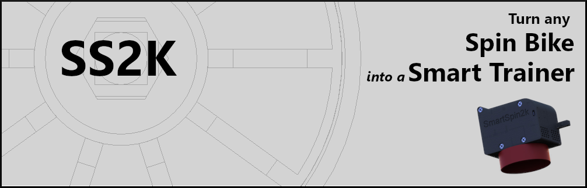
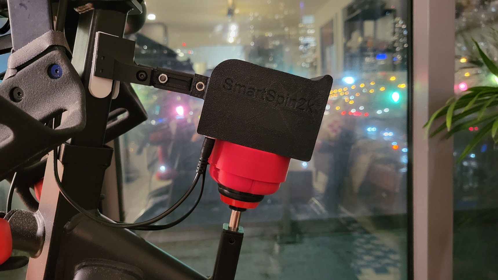

SmartSpin2k is an easy to build open source project that lets you turn any Spin Bike into a Smart Trainer. SmartSpin2k uses an ESP32 and stepper motor to let fitness apps like Zwift automatically control spin bikes that have a resistance knob. The SmartSpin2k also has shifter buttons that allow the user to simulate shifting gears on the stationary bike. 

Since SmartSpin2k is easy to manufacture, build one for yourself, build some for your friends, or setup a print farm and build them for everybody - we're an open community and welcome all levels of involvement!

## Important announcement for existing users
We have identified an issue with auto updates.  After a factory reset, you will not be able to access the configuration screen.  We advise users to flash the latest version of the 2.2.8 firmware, [available here](https://github.com/doudar/SmartSpin2k/releases).  Flashing instructions are available on the [Wiki](https://github.com/doudar/SmartSpin2k/wiki/Loading-Software)

### Documentation
Everything you need to know is in the [SS2K Wiki](https://github.com/doudar/SmartSpin2k/wiki)

If you'd like to get involved in SS2K but don't want to build your own, a limited number of kits are available on sale by our community members.  [Click here](https://github.com/doudar/SmartSpin2k/wiki/Prebuilt-Kits) for more information

 

[_^^@eMadman's IC4 model_](https://github.com/doudar/SmartSpin2k/tree/develop/Hardware/MODS/Case%20V2%20-%20Schwinn%20IC4%20Mod)

## Contributing
1. Install Microsoft Visual Code. https://code.visualstudio.com/
2. Install PlatformIO into Visual Code. https://platformio.org/platformio-ide
3. Install Pre-commit. https://pre-commit.com
4. Install pre-push git hooks: `pre-commit install --hook-type pre-push`
5. Open this project in PlatformIO.

## Licensing
The hardware designs in this project are licensed under the [CERN Open Hardware License Version 2 - Permissive license](Hardware/LICENSE).
The software in this project is licensed under the [GNU GENERAL PUBLIC LICENSE Version 2, June 1991 license](LICENSE).
